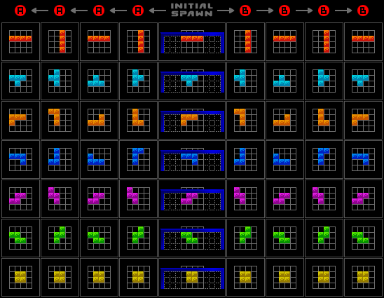

# Level 7: Rotation system change

> An unexpected change in requirements! Well, actually, it's always to be expected that there are changes in
> requirements. You just never know what will change and how - they are unknown unknowns.
>
> Did you know that Tetris has many different [rotation systems](https://tetris.wiki/Category:Rotation_systems)? This
> far we have used an informally-specified, ad hoc system. Let's change it to a well known rotation system.

Change the tetrominoes to use the [Arika Rotation System](https://tetris.wiki/Arika_Rotation_System), which is used for
example in the _Tetris: The Grand Master_ series:

The design of our old `RotatingShape` doesn't anymore fit these new needs, because in Arika Rotation System the T, L and
J shapes don't rotate around a single point. A better design could be to just hard-code the different orientations. That
should also allow removing quite much production and test
code - [code is a liability](https://wiki.c2.com/?SoftwareAsLiability).

Some unrelated tests might break as a result of this change. That means that the tests were coupled to the choice of a
rotation system. Think about how the tests could be designed differently, so that they would not be affected by this
change. Or at least do the migration in [small steps](https://tdd.mooc.fi/2-design#small-safe-steps), so that no more
than one test is broken at a time.

Some possible refactoring strategies:

- Use [test doubles](https://tdd.mooc.fi/3-challenges#test-doubles) instead of the official tetrominoes. For example the
  original [FallingBlocks.test.mjs](../test/FallingBlocks.test.mjs) does this by using a 1×1 block instead of a
  tetrominoe, and thus avoids being coupled to the rotation system.
- Use the [parallel change](https://tdd.mooc.fi/2-design#four-strategies) refactoring strategy and keep both the old and
  new classes side by side. Migrate the tests to use the new classes one test at a time.
- If there are tests which do a complex sequence of moving and rotating tetrominoes just to set up the board state in
  the beginning of a test, instead you could create a function for easily setting the board's initial state. Who knows,
  maybe they'll be useful also in production code (e.g. to implement save states).

## 73% done 🚀 [Continue to the next level](level-8.md)
